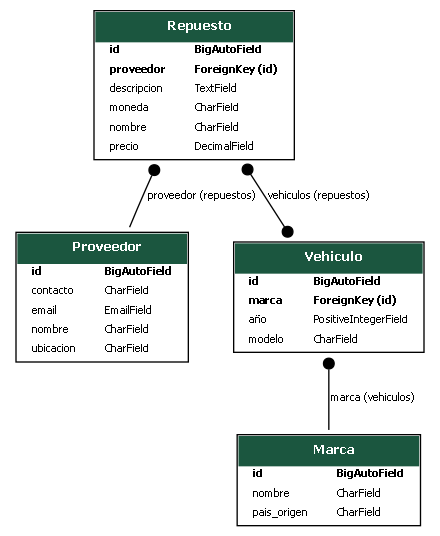

# API de Repuestos para Vehículos

## Descripción
Esta API permite gestionar proveedores y repuestos de manera eficiente. Los proveedores pueden registrarse y establecer precios para repuestos predefinidos, evitando la necesidad de crear cada pieza manualmente. Los usuarios pueden consultar repuestos y encontrar proveedores con sus respectivos precios.

## Diagrama de Modelos
Para generar el diagrama de modelos, usa el siguiente comando en Django Extensions:

```bash
python manage.py graph_models repuestos -o repuestos.png 

```

## Documentación de la API
Esta API incluye una interfaz de documentación automática en localhost. Para acceder a la documentación interactiva, visita la siguiente URL una vez que el servidor esté en ejecución:
- Documentación automática: http://localhost:8000/docs/

En esta página, podrás visualizar todos los endpoints disponibles, sus métodos y ejemplos de uso, facilitando la integración y pruebas.


## Diagrama de Modelos




## Caso de Uso

1. Registro de un proveedor:

```bash
curl -X POST "http://localhost:8000/api/proveedores/" \
-H "Content-Type: application/json" \
-d '{
    "nombre": "Repuestos ABC",
    "contacto": "Juan Pérez",
    "email": "juan@example.com",
    "ubicacion": "Bolivia"
}'
```

2. Asignar precio a un repuesto existente:

```bash
curl -X PATCH "http://localhost:8000/api/repuestos/1/" \
-H "Content-Type: application/json" \
-d '{
    "precio": 40,
    "moneda": "BOB",
    "proveedor": 1
}'
```

3. Consultar repuestos y precios:

```bash
curl -X GET "http://localhost:8000/api/repuestos/" \
-H "Content-Type: application/json"
```
## Para clientes:
Los clientes pueden buscar repuestos y encontrar proveedores con sus respectivos precios.

## 1️. Consultar repuestos disponibles

```bash
curl -X GET "http://localhost:8000/api/repuestos/" \

```

- Esto devolverá una lista de repuestos con detalles y precios ofrecidos por distintos proveedores.

## 2️.  Buscar repuestos por nombre

```bash
curl -X GET "http://localhost:8000/api/repuestos/?nombre=filtro de aire" \

```

- Esto ayudará a los clientes a encontrar piezas específicas y comparar precios fácilmente.

## Beneficios
-  Simplificación: Los proveedores solo ingresan sus precios en repuestos ya existentes.
-  Estandarización: Todos los repuestos están definidos en la base de datos.
-  Optimización: Menos carga para los proveedores, más facilidad para los clientes.
